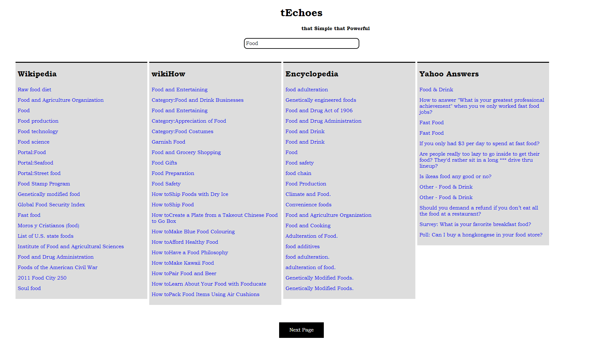
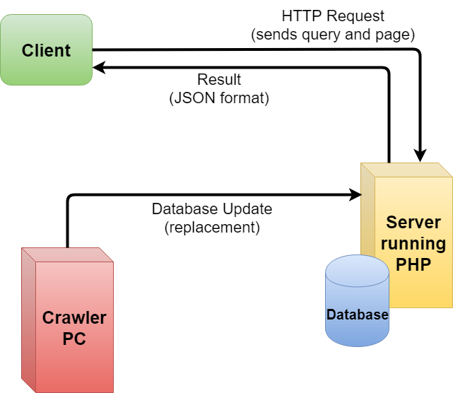

# tEchoes - Search Engine
that Simple that Powerful

## Example

## Inspiration 
The Web Is *Mostly* Full of Garbage. We all note that daily. But how can we look at it's bright side?  
The answer is pretty simple.

## Tagline
*Alternate:* Echo your search across multiple websites from one location. 

**tEchoes**
## What it does
**tEchoes** is a search engine with restricted websites list. The list–for now–is the following:
- https://en.wikipedia.org/
- https://www.wikihow.com
- https://www.encyclopedia.com/
- https://answers.yahoo.com/

## Built With
- HTML, CSS, JQuery for the website
- Python Web Crawler uses BeautifulSoup for data pulling and ThreadPool for multithreading
- SQLite as main database
- PHP responsible for the server side answers

## Preparatory Work - Crawler
SQlite database is constructed locally. The Python crawler creates one database for each website.

An Example of Wikipedia database:

title|URL
|-|-
|. . .|. . .|
|Ancient Greece|https://en.wikipedia.org/wiki/Ancient_Greece|
|. . .|. . .|
|Space-time|https://en.wikipedia.org/wiki/Space-time|
|. . .|. . .|
|Amazon (company)|https://en.wikipedia.org/wiki/Amazon_(company)|
|. . .|. . .|
>**Explanation**\
> title: websites title\
> URL: websites URL

## Why multithreading?
Web crawling is basically a I/O procedure. Because of this, there is a huge bottle neck. Waiting time can be reduced using a thread for each initial website.

## UML Diagram

